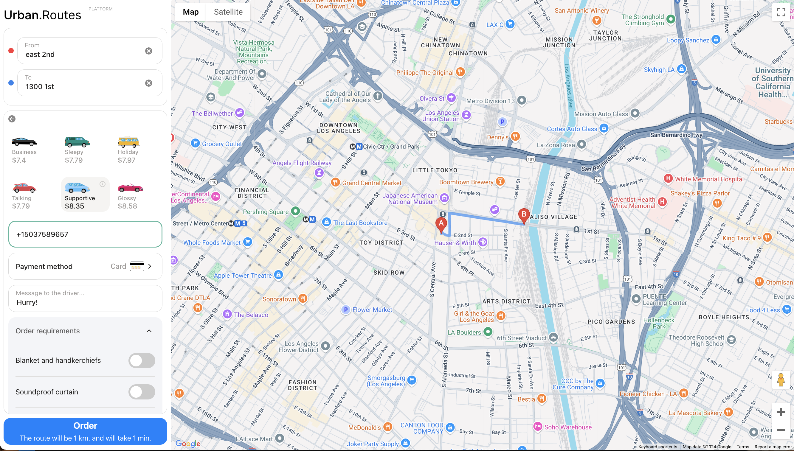

# E2E Testing On a Ride-hailing Web-app Using WebDriverIO

## Project Description

This project is designed to perform end-to-end (E2E) testing for the Urban Routes web application, similar to ride-booking services like Uber. This is ran off a private server provided by TripleTen for testing educational purposes. It automates the testing of various functionalities such as entering addresses, adding randomized phone numbers, selecting different options, saving credit card information, and messaging drivers.

## Technologies Used ##
- **Javascript**
- **Node.js**
- **WebDriverIO**
- **Mocha**

## Techniques Used ##
- **Page Object Model (POM)** <br>
For example, in `page.js`, elements like `fromField`, `toField`, and `phoneNumberField` are encapsulated within a class to streamline their usage across different test cases.

- **Network Request Interceptor** <br>
For example, `await browser.setupInterceptor();` starts intercepting requests, and `const requests = await browser.getRequests();` collects and inspects them. In the case of our testing, this allows for the system to retrieve the verification code sent in order to verify the phone number.

- **Randomized Data Generation** <br>
You can find the function for generating randomized data in the `helper.js` file of the project. For example, the `getPhoneNumber` function in `helper.js` creates new phone numbers for each test execution.

- **Element Visibility Checks** <br>
For example, `await $(this.callATaxiButton).waitForDisplayed();` ensures the button is visible before clicking it.

- **Element Interaction** <br>
 For example, `await $(this.nextButton).click();` simulates a user clicking the "Next" button.

 ## How To Run Tests
 - Make sure you have `Node.js` installed
 - Using `Node.js` install your dependencies
 (WebDriverIO, Mocha)
 ``` bash
 npm install webdriverio --save-dev
 ```
 ``` bash
 npm install mocha --save-dev
 ```
 - Obtain a valid, up-to-date active server URL address from `TripleTen`. Replace the server URL into the baseURL of the `wdio.config.js` file

 - Finally, in the terminal of the project run the command
 ``` bash
 npm run wdio
 ```
  


